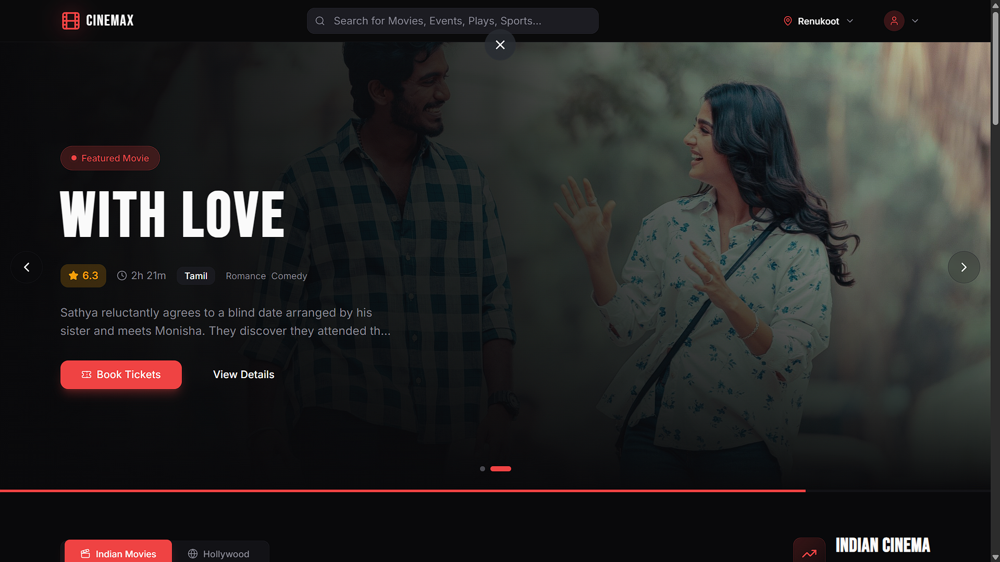
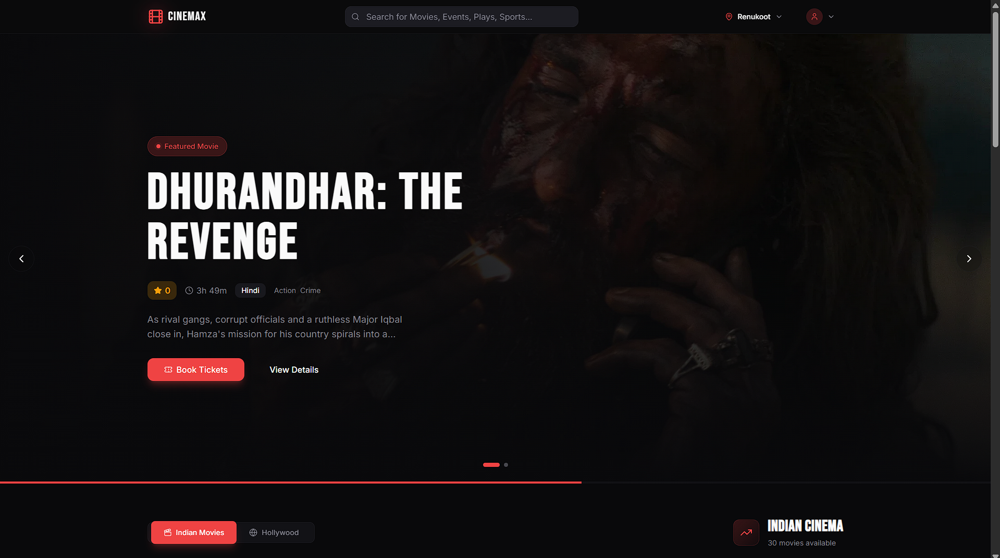
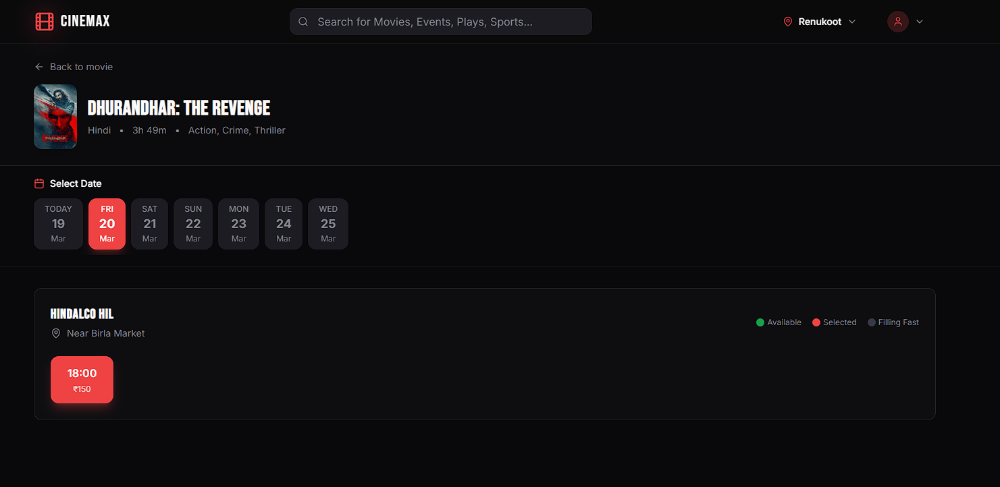
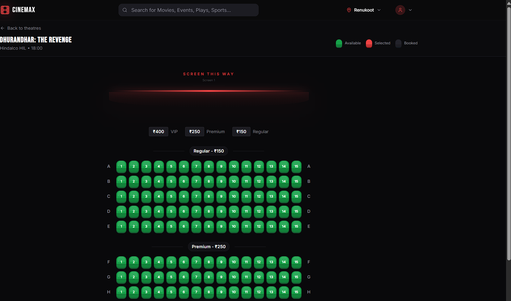
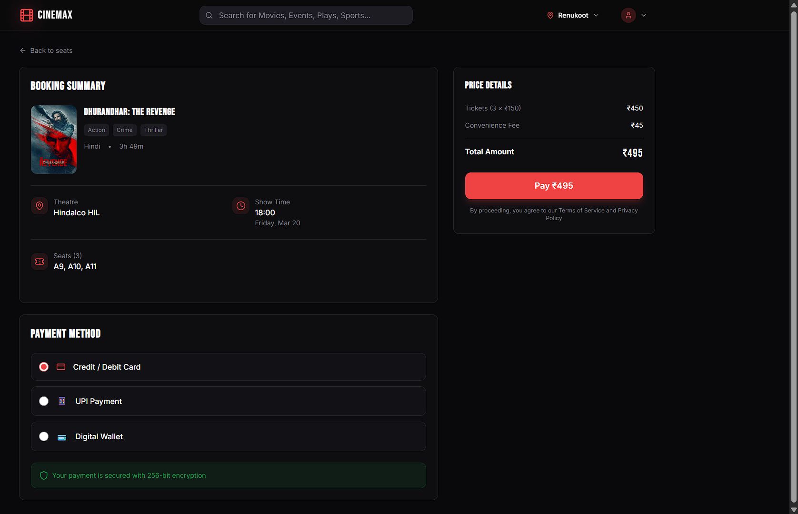
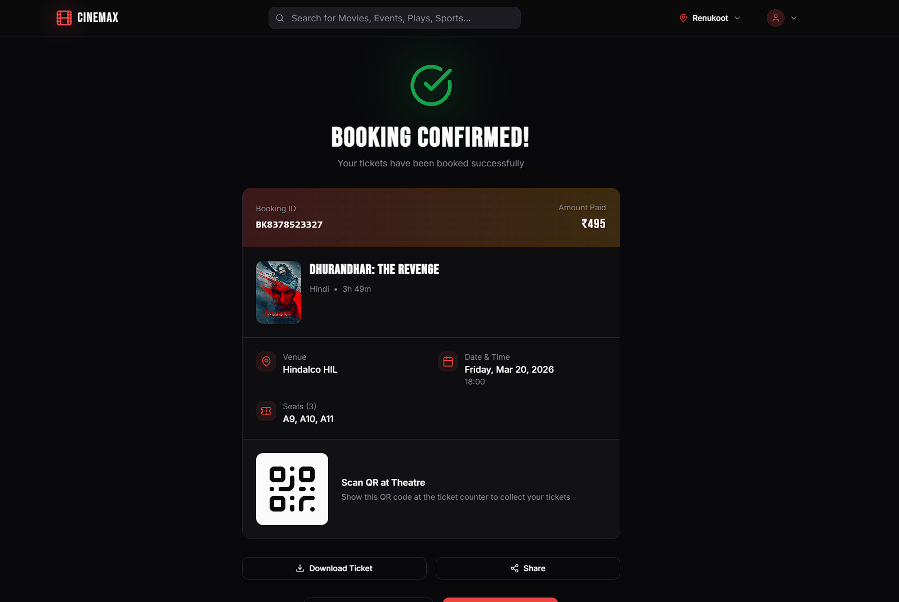
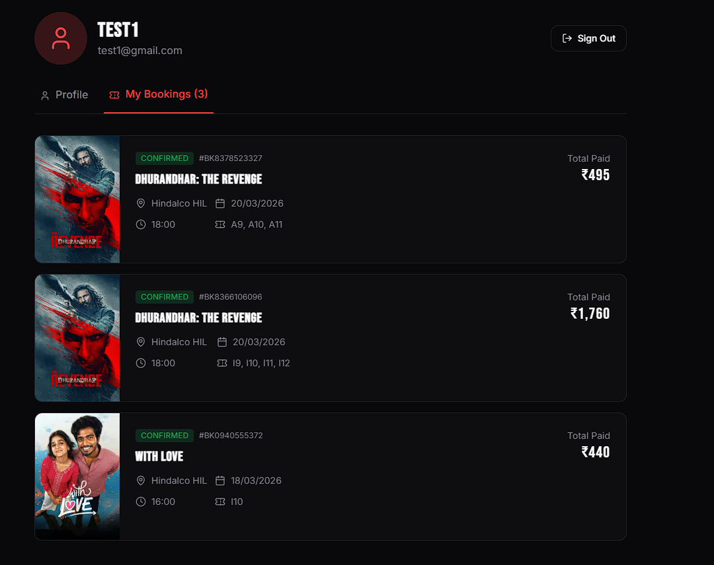
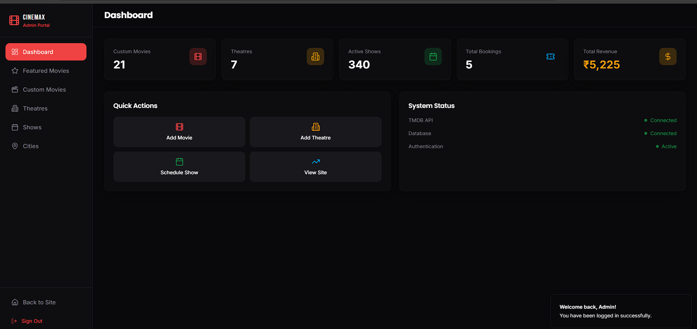

# 🎬 ShowTime Hub (Movieee) - Enterprise Cinema Management System

<div align="center">
  
</div>

**ShowTime Hub** is a highly scalable, full-stack enterprise-grade digital cinema and movie ticket booking application. Engineered with modern **TypeScript ecosystem** and featuring a **Microservices-inspired modular backend**, this platform offers a robust, seamless, and lightning-fast experience for scheduling, browsing, and ticketing real-time events.

---

## ⚡ Core Enterprise Features & Architecture

### 🛡️ **Role-Based Access Control & Stateless Auth (RBAC)**
- **Enterprise Security Model:** Employs **JWT-based stateless authentication** with robust password hashing (bcryptjs) and secure cookie transmission.
- **Granular RBAC:** Distinguishes between standard 'User' and 'Administrator' workloads implicitly, securing endpoints at the routing middleware layer.
- **API Security:** Hardened with **Helmet** and **Express Rate Limiting** to prevent DoS attacks and brute-force attempts.

### 🎢 **Real-Time Concurrent Seat Selection**
- **Concurrency Control Mechanism:** Implements a robust **Atomic Seat Locking** algorithm mitigating race conditions during peak load. Prevents double-booking via optimistic concurrency validation.
- **Background Worker Processing:** Utilizes **Node-Cron** daemon processes to automatically purge abandoned seat locks asynchronously, optimizing database throughput.

### 💳 **Secure Payment Processing & Transactions**
- **Financial Grade Integrity:** Deep integration with **Stripe API** for secure, high-availability payment intent processing and real-time checkout validations.
- **Event-Driven Communications:** Automated transactional email receipts and e-tickets generated via **NodeMailer** and **jsPDF**.

### 🏗️ **Robust Admin Management Panel**
- **Comprehensive Entity Orchestration:** Administrators have full CRUD lifecycle control over hierarchical models: `City → Theatre → Screen → Show → Movie`.
- **Relational Data Integrity:** Strictly enforced foreign key constraints via **Sequelize ORM** interacting with a **MySQL 8.x** relational database cluster.

---

## 🛠️ Cutting-Edge Technology Stack

- **Frontend Application Layer:**
  - **React 18** paired with **Vite** for instantaneous Hot Module Replacement (HMR).
  - **TypeScript** natively integrated for End-to-End type safety.
  - **Tailwind CSS & shadcn/ui** for an accessible, pixel-perfect, and highly deterministic UI design system.
  - **TanStack Query (React Query)** handling asynchronous server-state management, cache invalidation, and request deduplication.

- **Backend Application Layer:**
  - **Node.js & Express.js** runtime executing a highly performant RESTful API layer.
  - **MySQL & Sequelize Object-Relational Mapper (ORM)** for complex joins, aggregations, and ACID-compliant transactions.
  - **Swagger UI** for automated and interactive API documentation generation (`swagger-jsdoc`).

- **DevOps & Infrastructure:**
  - **Docker & Docker Compose** for deterministic, reproducible containerized deployments mimicking production environments perfectly.

---

## 📸 System Walkthrough & UI Showcase

### 1. Seamless User Browsing & Discovery
Designed for maximum conversion with a fluid, responsive UI.
<p float="left">
  
  
</p>

### 2. High-Concurrency Booking Pipeline
From selecting the exact seat to secure payment processing.
<p float="left">
  
  
</p>

### 3. Automated Post-Transaction Fulfillment
Users instantly get access to their confirmed reservations.
<p float="left">
  
  
</p>

### 4. Administrator Control Plane
Full control over the platform's hierarchical scheduling logic.
<p float="left">
  
  
</p>

---

## 🚀 Rapid Local Setup & Execution

Run the entire cluster locally in seconds using Containerization. No complex external deployments required.

```bash
# 1. Clone the repository
git clone <YOUR_GIT_URL>
cd Movieee

# 2. Spin up the application via Docker Compose
docker-compose up --build
```
*Docker will automatically orchestrate the React Frontend (`:8081`), the Express Backend API (`:5000`), and a dedicated MySQL database container.*

<br/>

> **Note on Manual Setup:** If you prefer running without Docker, simply configure the `.env` file in the `server` directory and use `npm install` && `npm run dev` in both the root and `server` directories respectively.

---

<p align="center">Made with ❤️ from Abhinav and high-performance algorithms.</p>
